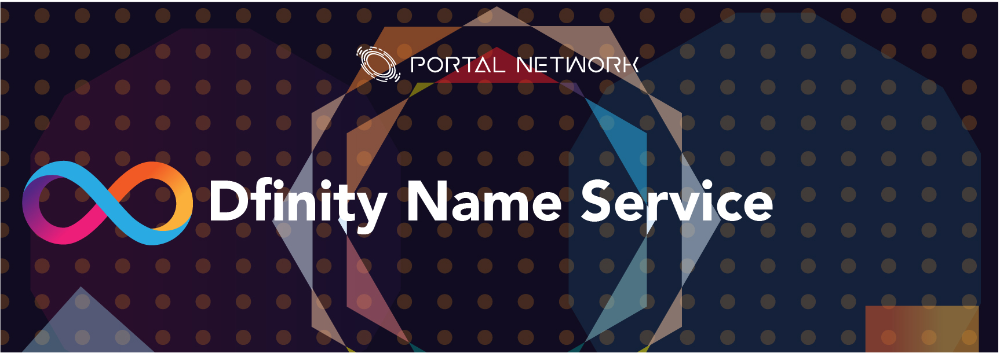

> 📖🔍 Documents of the Dfinity Name Service.

## 💡 What is Dfinity?
A blockchain supercomputer designed to host the next generation of software and services.

## 💡 What is BNS?
BNS – or blockchain name system – is the protocol on the internet that turns human-comprehensible decentralized website names such as 'website.mith' or 'mywebsite.eth' into addresses understandable by decentralized network machines.

## 📝 Description
DFNS is the Dfinity Name Service, a distributed, open, and extensible naming system based on the Dfinity blockchain.

## 📚 Documents

#### Table of Contents
-  [Introduction](./docs/INTRODUCTION.md)

## 📣 Contributing
See [CONTRIBUTING.md](./CONTRIBUTING.md) for how to help out.

## 🗒 Licence
See [LICENSE](./LICENSE) for details.
